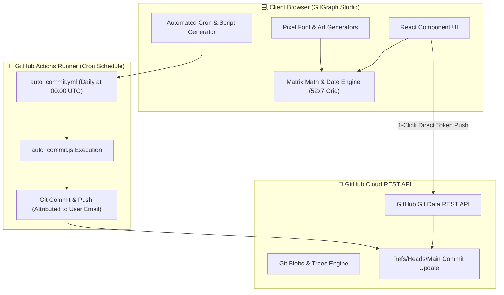

# 🎨 GitGraph Studio — Contribution Graph Art & Automated Cron Bot

> **Design custom GitHub contribution graph pixel art, spell text across your calendar matrix, backdate commits via 1-click browser push with rate-limit resilience, or deploy an automated daily cron bot to any repository.**

[](https://react.dev/)
[](https://vitejs.dev/)
[](LICENSE)

---

## 🌟 Overview

**GitGraph Studio** is a full-stack web application that empowers developers to customize their GitHub contribution graph. Whether you want to backfill missing activity, create pixel art logos, spell text across your contribution graph, or deploy a daily GitHub Actions bot for automatic graph maintenance, GitGraph Studio provides a sleek, Developer Cyberpunk interface.

---

## 🤖 How to Set Up the Automated Cron Bot in a New Repository

Follow these step-by-step instructions to set up the automated daily commit bot in any repository (or a dedicated private repository):

### 1️⃣ Step 1: Create a Repository
- Create a new repository on GitHub (e.g. `my-daily-tracker` or `leetcode-journey`). It can be **Public** or **Private**.

### 2️⃣ Step 2: Add Workflow and Script Files
Create the following directory structure in your repository:
```text
my-repository/
├── .github/
│   └── workflows/
│       └── auto_commit.yml   <-- Workflow configuration
├── scripts/
│   └── auto_commit.js        <-- Generator script
└── package.json
```

- Copy **`.github/workflows/auto_commit.yml`** and **`scripts/auto_commit.js`** from GitGraph Studio (using the **Automated Cron Scheduler** tab) or from this repository.

### 3️⃣ Step 3: Enable Write Permissions in GitHub Settings
For GitHub Actions to push commits back to your repository:
1. Go to your GitHub Repository -> **Settings** -> **Actions** -> **General**.
2. Scroll down to **Workflow permissions**.
3. Select **Read and write permissions**.
4. Click **Save**.

### 4️⃣ Step 4: Set Your Email for Personal Graph Credit
To ensure the commits show as **green squares on your GitHub profile graph**:
- **Option A (Secret)**: Go to **Settings** -> **Secrets and variables** -> **Actions** -> **New repository secret**. Name: `COMMIT_EMAIL`, Value: your primary GitHub email (e.g. `yourname@gmail.com`).
- **Option B (Direct)**: Edit `.github/workflows/auto_commit.yml` and replace `'your-github-email@gmail.com'` with your actual GitHub account email.

### 5️⃣ Step 5: Commit & Push
```bash
git add .
git commit -m "feat: initialize automated daily commit cron bot"
git push origin main
```

Your bot will now automatically commit daily at 00:00 UTC (or your custom schedule)! You can also trigger it manually anytime under the **Actions** tab by clicking **Run workflow**.

---

## 🏗️ System Architecture



---

## ✨ Key Features

- 🎨 **Interactive 52x7 Matrix Canvas**:
  - Drag-and-paint brush tool with 5 intensity levels (Level 0 - Level 4).
  - Quick action controls: *Invert*, *Randomize*, *Clear*, and *Fill Grid*.
  - Real-time cell hover tooltips showing date strings and calculated commit counts.

- 🤖 **Automated Cron Scheduler & Code Generator**:
  - Custom cron frequency generator (Midnight UTC, Weekdays, 3x Weekly, Custom).
  - Content options: **LeetCode / DSA Solutions** (`solutions/`), **Technical Study Notes** (`notes/`), **Activity Logs** (`data/`), and **Hybrid Mix**.
  - Human realism modes (random rest days, commit intensity ranges).
  - Generates working `.github/workflows/auto_commit.yml` & `scripts/auto_commit.js`.

- 🚀 **1-Click Direct Browser API Push with Rate-Limit Resilience**:
  - Backdate commits directly from the browser using a GitHub Personal Access Token (PAT).
  - Live GitHub API rate-limit quota inspection, request throttling, exponential backoff, and resume capabilities.

- 🖥️ **Rate-Limit-Free Local CLI Scripts**:
  - 1-click export to **PowerShell (`.ps1`)**, **Bash (`.sh`)**, and **JSON (`commits.json`)**.
  - Bypasses GitHub REST API limits using local `git commit` commands.

---

## 🚀 Quick Start (Local Web App Development)

```bash
# 1. Clone repository
git clone https://github.com/realranjan/git_cron_schedular.git
cd git_cron_schedular

# 2. Install dependencies
npm install

# 3. Start local dev server
npm run dev
```

Open [http://localhost:5173](http://localhost:5173) in your browser!

---

## 📜 License

Distributed under the MIT License. See `LICENSE` for more information.
