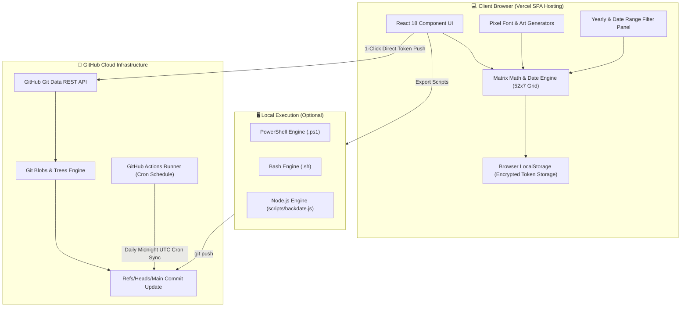

# 🎨 GitGraph Studio — Contribution Graph Art & Automated Backdate Engine

> **Design custom GitHub contribution graph pixel art, spell text across your calendar matrix, backdate commits via 1-click browser push, and schedule automated daily activity workflows.**

[](https://react.dev/)
[](https://vitejs.dev/)
[](https://github.com/features/actions)
[](https://vercel.com/)
[](LICENSE)

---

## 🌟 Overview

**GitGraph Studio** is a full-stack, serverless web application that empowers developers to customize their GitHub contribution graph. Whether you want to backfill missing activity, create pixel art logos, spell text across your contribution graph, or automate daily commits to maintain a streak, GitGraph Studio provides a sleek, Developer Cyberpunk interface to accomplish it seamlessly.

---

## 🏗️ System Architecture

GitGraph Studio operates on a **Zero-Server, Client-First Serverless Architecture**. Sensitive credentials (Personal Access Tokens) never touch a third-party backend and remain strictly inside the user's browser runtime.



---

## 🛠️ What Was Used to Build It (Tech Stack Breakdown)

### 1. **Frontend & Application Core**
- **[React 18](https://react.dev/)**: Reactive UI state management for real-time canvas rendering, intensity selection, and date filters.
- **[Vite 6](https://vitejs.dev/)**: Ultra-fast build engine and HMR development server.
- **JavaScript ES Modules (ES6+)**: Clean, modern module structure across utilities and components.

### 2. **Design System & Visual Aesthetics**
- **Developer Cyberpunk & Glassmorphism Aesthetics**: Built with deep dark backgrounds (`#030712`), frosted glass overlays (`backdrop-filter: blur`), and emerald contribution glow accents (`#10b981` / `#34d399`).
- **Typography**: Paired Google Fonts—[Inter](https://fonts.google.com/specimen/Inter) for clean UI labels and [JetBrains Mono](https://fonts.google.com/specimen/JetBrains+Mono) for mono dates, status logs, and code previews.
- **CSS3 Design Tokens**: Fully custom CSS architecture with semantic tokens, custom properties (`var(--...)`), and smooth micro-animations (`src/index.css`).

### 3. **GitHub Integration & API Execution**
- **[@octokit/rest](https://github.com/octokit/rest.js)**: Official GitHub REST client used for client-side authentication, blob creation, tree generation, commit signing, and branch reference updates.
- **Direct Git Low-Level Engine**: Programmatically constructs GitHub commit object chains with backdated author/committer timestamps without requiring a local Git installation.

### 4. **Icons & UI Components**
- **[Lucide React](https://lucide.dev/)**: Clean, minimal iconography (`Paintbrush`, `Calendar`, `Zap`, `SlidersHorizontal`, `ShieldCheck`).

### 5. **Automation & Serverless Deployment**
- **[GitHub Actions](https://github.com/features/actions)**: Native CI/CD cron pipeline (`.github/workflows/auto_commit.yml`) running scheduled Node.js scripts daily at 00:00 UTC.
- **[Vercel](https://vercel.com/)**: Global edge CDN hosting configured with custom SPA rewrite rules (`vercel.json`).

---

## ✨ Key Features

- 🎨 **Interactive 52x7 Matrix Canvas**:
  - Drag-and-paint brush tool with 5 intensity levels (Level 0 - Level 4).
  - Quick action controls: *Invert*, *Randomize*, *Clear*, and *Fill Grid*.
  - Real-time cell hover tooltips showing date strings and calculated commit counts.

- 📅 **Yearly View Switcher & Advanced Date Filters**:
  - Switch canvas view between **Past 365 Days**, **2026**, **2025**, **2024**, and **2023**.
  - Custom Date Range filter panel (`From Date` / `Till Date`).
  - Search engine to locate and highlight specific dates or months in real time.
  - Day-of-week checkboxes (*Sun*, *Mon*, *Tue*, *Wed*, *Thu*, *Fri*, *Sat*).
  - Batch action operations (*Paint*, *Randomize*, or *Clear* on filtered date ranges).

- 🚀 **1-Click Direct Browser API Push**:
  - Backdate commits directly from the browser using a GitHub Personal Access Token (PAT).
  - Zero local Git installation required—executes using GitHub's Git Data REST API.
  - Built-in token verification, live progress indicator, and streaming execution logs.

- 🔤 **Text Generator & Pixel Art Presets**:
  - Built-in 5x7 pixel font map to spell custom text (A-Z) on the contribution graph.
  - One-click presets: *Heart Beats*, *Space Invader*, *Streak Master*, and *Realistic Backfill*.

- 🤖 **Automated GitHub Actions Cron Scheduler**:
  - Native `.github/workflows/auto_commit.yml` workflow for automated daily commits.
  - Runs 24/7 on GitHub Actions cloud infrastructure.

- 🛡️ **100% Client-Side Privacy & Security**:
  - Tokens and credentials are processed strictly in-memory or saved in browser `localStorage`.
  - Zero backend databases or third-party servers storing user keys.

---

## 🚀 Quick Start (Local Development)

### Prerequisites
- [Node.js](https://nodejs.org/) v18 or higher
- `npm` or `yarn`

### Setup Steps
```bash
# 1. Clone the repository
git clone https://github.com/realranjan/git_cron_schedular.git
cd git_cron_schedular

# 2. Install dependencies
npm install

# 3. Start local development server
npm run dev
```

Open [http://localhost:5173](http://localhost:5173) in your browser to start painting!

---

## 📖 How to Use

### Option 1: Direct 1-Click Browser Push (Recommended)
1. Open GitGraph Studio and paint your contribution graph or generate a preset.
2. Click **Export Commits**.
3. Select the **Direct 1-Click Push (GitHub Token)** tab.
4. Enter your **GitHub Owner**, **Repository Name** (e.g. `git_cron_schedular`), and a **Personal Access Token (PAT)** with `repo` permissions.
5. Click **Verify Token & Repo**, then click **🚀 Direct Push Commits to GitHub**.

### Option 2: Automated GitHub Actions Cron Bot
1. Fork or push this repository to your GitHub account.
2. Go to your repository's **Actions** tab on GitHub:
   - `https://github.com/<your-username>/git_cron_schedular/actions`
3. Click **Enable workflows**.
4. Go to **Settings -> Actions -> General -> Workflow permissions** and select **Read and write permissions**.
5. The bot will automatically commit daily at 00:00 UTC!

### Option 3: Local Script Export (PowerShell / Bash / Node.js)
1. Paint your matrix in GitGraph Studio and click **Export Commits**.
2. Download the script of your choice:
   - **PowerShell (`.ps1`)**: Run `.\backdate.ps1` in your repository root.
   - **Bash (`.sh`)**: Run `bash backdate.sh` in your repository root.
   - **JSON (`commits.json`)**: Save to `data/commits.json` and run `node scripts/backdate.js`.
3. Push to GitHub: `git push origin main`.

---

## 🔒 Security & Token Scope

To use Direct Browser Push, create a [GitHub Personal Access Token (Classic)](https://github.com/settings/tokens):
- **Scope required**: `repo` *(Full control of private repositories)*
- Your token is stored locally in your browser and is only sent directly to `https://api.github.com`. It is **never** sent to any intermediate server.

---

## 📜 License

Distributed under the MIT License. See `LICENSE` for more information.

---

<p align="center">Made with ❤️ by <a href="https://github.com/realranjan">realranjan</a></p>
