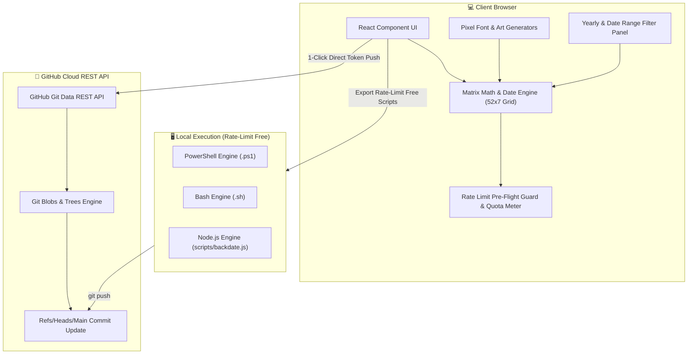

# 🎨 GitGraph Studio — Contribution Graph Art & Backdate Sync Engine

> **Design custom GitHub contribution graph pixel art, spell text across your calendar matrix, backdate commits via 1-click browser push with rate-limit protection, or export rate-limit-free local scripts.**

[](https://react.dev/)
[](https://vitejs.dev/)
[](LICENSE)

---

## 🌟 Overview

**GitGraph Studio** is a full-stack, serverless web application that empowers developers to customize their GitHub contribution graph. Whether you want to backfill missing activity, create pixel art logos, spell text across your contribution graph, or generate local CLI scripts, GitGraph Studio provides a sleek, Developer Cyberpunk interface to accomplish it seamlessly.

---

## 🏗️ System Architecture

GitGraph Studio operates on a **Zero-Server, Client-First Serverless Architecture**. Sensitive credentials (Personal Access Tokens) never touch a third-party backend and remain strictly inside the user's browser runtime.



---

## 🛠️ Tech Stack Breakdown

### 1. **Frontend & Application Core**
- **[React 19](https://react.dev/)**: Reactive UI state management for real-time canvas rendering, intensity selection, and date filters.
- **[Vite 8](https://vitejs.dev/)**: Ultra-fast build engine and HMR development server.
- **JavaScript ES Modules**: Clean, modern module structure.

### 2. **Design System & Visual Aesthetics**
- **Developer Cyberpunk & Glassmorphism Aesthetics**: Deep dark backgrounds (`#030712`), frosted glass overlays (`backdrop-filter: blur`), and emerald contribution glow accents (`#10b981` / `#34d399`).
- **Typography**: Paired Google Fonts—[Inter](https://fonts.google.com/specimen/Inter) for UI labels and [JetBrains Mono](https://fonts.google.com/specimen/JetBrains+Mono) for mono dates, status logs, and code previews.

### 3. **GitHub API Engine & Rate-Limit Resilience**
- **[@octokit/rest](https://github.com/octokit/rest.js)**: Official GitHub REST client for blob creation, tree generation, and commit signing.
- **Rate Limit Pre-Flight Inspection**: Real-time quota check (`octokit.rest.rateLimit.get()`).
- **Request Throttling & Exponential Backoff**: 120ms delay pacing per commit with backoff retries on HTTP 403/429 limits.
- **Resume Execution Engine**: Resume interrupted commit runs starting from any specific commit index.

---

## ✨ Key Features

- 🎨 **Interactive 52x7 Matrix Canvas**:
  - Drag-and-paint brush tool with 5 intensity levels (Level 0 - Level 4).
  - Quick action controls: *Invert*, *Randomize*, *Clear*, and *Fill Grid*.
  - Real-time cell hover tooltips showing date strings and calculated commit counts.

- 🚀 **1-Click Direct Browser API Push with Rate-Limit Protection**:
  - Backdate commits directly from the browser using a GitHub Personal Access Token (PAT).
  - Live GitHub API rate-limit quota inspection and throttling pacing.
  - Resume capability if paused or rate-limited.

- 🖥️ **Rate-Limit-Free Local CLI Scripts**:
  - 1-click export to **PowerShell (`.ps1`)**, **Bash (`.sh`)**, and **JSON (`commits.json`)**.
  - Local scripts execute standard `git commit` commands with **zero GitHub REST API limits**.

- 🔤 **Text Generator & Pixel Art Presets**:
  - Built-in 5x7 pixel font map to spell custom text (A-Z) on the contribution graph.
  - One-click presets: *Heart Beats*, *Space Invader*, *Streak Master*, and *Realistic Backfill*.

- 🛡️ **100% Client-Side Privacy & Security**:
  - Tokens and credentials processed strictly in-memory or saved in browser `localStorage`.
  - Zero backend databases or third-party servers storing user keys.

---

## 🚀 Quick Start

```bash
# 1. Clone repository
git clone https://github.com/realranjan/git_cron_schedular.git
cd git_cron_schedular

# 2. Install dependencies
npm install

# 3. Start local dev server
npm run dev
```

Open [http://localhost:5173](http://localhost:5173) in your browser!

---

## 📜 License

Distributed under the MIT License. See `LICENSE` for more information.
